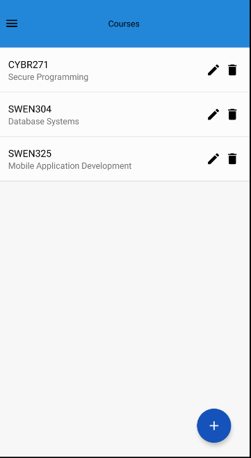
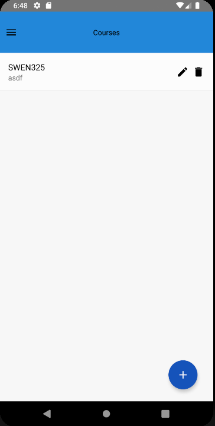

### SWEN325 Assignment 2 Report
###### Philip Oliver 300398228

#### Application Architecture

Mobile application architecture is split into 4 layers. These layers are: Presentation, 
Business, Data Access, and Service. In an ideal architecture, these 4 layers will be separate 
from each other.

  
*Image from 'Mobile Architecture Guide': Microsoft*

##### Presentation Layer

The presentation layer in a mobile application is made up of UI components
and other processes involved in creating the UI of the application.

The presentation layer in a react native application is typically represented in the 
render methods of the components. These render methods return react native tags
which are converted into native Android or iOS components for the UI.

The tags can be seen in the above image. These are the tags which are converted
to the native components for the app.

##### Business Layer

The business layer in a mobile application is made up of workflows. These
workflows allow the flow of data and providing data to the presentation layer.

In a react native application, the business layer is typically represented
as the methods in classes and components supporting the logic of the data flow.
This can be seen in the below screenshot: 

These methods provide interaction between the presentation and data access layer,
thus separating the other two layers and providing a workflow for the data.

##### Data Access Layer

The data access layer in a mobile application controls fetching and updating data 
stored in the application, or access to external storage components.

My implementation of the data access layer in my react native app was through the use
of utilities. These utilities were stored separately from the pages in a separate
folder and provided an interface between the business layer and the services the 
utilities talked to (such as firebase).
The services created were an authentication service, and a database service; 
these provided functionality through the use of functions which
were used by multiple pages. This abstraction also allowed for use of a 
singleton pattern, where there was at most one instance of each utility class.

The above image shows some of the main functions in the firestore utility.
As can be seen, this utility accesses firebase to put and fetch data from the
services.

##### Services

The service agents in the data access layer communicate with firebase 
in order to provide authentication and user storage. Between these two 
layers is a local cache. This cache stores data received from firebase 
and edits the local copies when a user edits the items before sending the 
changes or fetching from the externally stored firebase. This allows for quicker
response times when fetching data, and semi-persistent storage, in case the
phone's connection is unreliable. 

##### Organisation

The organisation of my folders can be seen above. Pages relating to different 
functionalities in the app are stored in different folders. This can be seen with 
the authentication, courses, and tasks folders. Utilities are stored in the util 
folder. These allow access to firestore and firebase, and also provide
tools required for switching pages (which will be discussed later).

#### Major External Component

The major external component I used for my application was Firebase. 
I made use of both the authentication and database services of Firebase.

In order to integrate Firebase to the application, it had to be added to
the build.gradle file for the app. The app then had to connect to Firebase
using the app name to be identified by Firebase. The access to Firebase
was stored in util files. This was the best way to add Firebase because 
it meets the separation of mobile architecture layers.

##### Authentication

The above image shows some registered users in the Firebase authentication service.
These are all users that have registered through the application. Registration and 
authentication was facilitated through my FirebaseUtils.js file, in which 
communication with Firebase happened through the react-native-firebase library.   
In addition to this, when a user was created, an entry for that user was created in the 
database. This was done so that the user would be able to add courses and tasks for 
their use of the application.

##### Database

The database in Firebase which I used was constructed in a hierarchical structure.
This structure has users as the top level and with courses and tasks (respectively) 
extending down from the previous layer as can be seen in the images below. 
This allowed for a pseudo-foreign key relation between users, courses, and tasks where
courses belong to users, and tasks belong to courses.  

When a user adds a course or task, it is added to the database under their user
entry. This was facilitated by use of my FirestoreService.js file. This allowed
entering and retrieving data from the database, which also providing a caching service
in order to increase the response times from the external database. 

#### Reflection on React Native Framework

After the previous assignment with the app in Ionic, I thought that I would enjoy this
assignment more as I have used React previously. However, I was so wrong.

##### Versions
A problem I came across frequently was that the versions were changing far too frequently
for the documentation for most react native items to be kept up to date. This lead to 
far too many issues when trying to implement features into my app. For example, when I 
was adding a Drawer Navigator to my app, it took far too long to implement. This was 
because I was following react native documentation which was not up to date with the 
latest way of implementing the navigator.  
Another example, was when I tried to add a user created slider picker. I found a user
created picker which was perfect for what I wanted it for. However, it did not work 
when it was added in as the latest version of react, which had been included in the
version of react native I was using did not support some of the functions used in the 
picker. This was frustrating, as many problems came of react being updated so frequently.

##### Setup
The main problem I had with react native was due to the setup of the application.
I ran into many issues adding navigation (as discussed above), but also in integrating
firebase into the application. This stemmed from the issues due to outdated documentation,
but eventually I overcame this by using a react native firebase starter project. This 
project already had most of the firebase setup done. I then only had to connect the app
to my firebase project. 

##### Separation of Architecture
As a framework compared to ionic, react native does not have inbuilt separation of the 
layers of mobile architecture. In ionic with angular, the layers are separated through
use of services and different files for the layers. However, in react native this 
separation isn't supplied to the user explicitly. This means that it would be easier
to mix together different layers, thus not following the mobile architecture guide. 

##### Possible Improvements
Some possible improvements that could be made to react native are:
* More consistent documentation throughout versions. This would help to ensure
that applications break less frequently, as there would be consistent documentation
for each version. In addition to this, versions should have information about what 
they will contain or make deprecated prior to versions being released.
* A more straightforward setup process. This would make application development 
far more accessible. This would also benefit from better documentation, which would
provide instructions on how to set up an application in different versions and without
difficulties in adding things to build.gradle files. 

#### UX Decisions

##### Log In Page

One of the first UX decisions I made while creating this application was as an 
alternative to the login page in my ionic app. I decided to use the firebase error
messages and display them above the email text input. Such an error message can be
seen in the below image. 

This option ensures that the user will understand why their login failed in the case that 
it does. This is good practise, as the user is not left in the dark about why their login
failed, and know what they need to change to make it work.

An alternative option I considered was my implementation from the previous application in 
ionic. This implementation (as can be seen below) had the log-in button grayed out when 
the user had not entered valid details. 

I decided to opt for the first option for one main reason:
* The first option, while not as tidy as the second, provides the user with much 
more information about why their login didn't work. In addition to this, it makes
the most of firebase's built-in error handling and thus made the implementation much
simpler. 

##### Create New Button

Another UX decision I made was to use a floating button in the bottom right of the screen
for adding new courses and tasks. 

An alternative option I explored was to have some text underneath the courses or tasks
which included a link to the add new course/task page. This is not dissimilar from how the 
page looks when there are no courses or tasks which can be seen below. However, the text
would simply read "Add a Course" and would be positioned in a \<Text\> tag right underneath
the courses or tasks.

The reasons I chose the first option were:
* The floating nature of the button means that if the whole page were to be filled with 
courses/tasks, the button would always remain in the same position and would display
over the courses/tasks. This allows the user to easily add a course/task without having 
to find where the button has moved to.
* The fixed position of the button in the lower right corner is in an optimal position for the
standard user. It is easily accessible by a small thumb movement and requires little effort
to reach. If the other option were chosen and there were no, or a small number of courses/tasks
the user would have to reach to the top of the screen to add a new course/task.
* The lower right placement of a floating button is seen frequently in Android applications.
This means that a user would instinctively know what the button would do, as they will have seen
this in other applications, as it is a somewhat unified design.

##### Menu Bar

The final UX decision I made was the implementation of the menu bar. While this does
not at first seem like a UX decision in itself, it was done to improve the functionality
through speed, and to reduce the overall size of the application. The menu bar can be
seen in the below screenshot. It is the blue bar at the top of the screen.

The implementation of the menu bar can be seen below. The menu bar (\<Header\>)
is only rendered in one component; the AppView. The content underneath the 
menu bar is rendered through the use of the getView functional component. This
finds the relevant view to render it and renders it below the Header component
without also requiring re-render of the Header. 

The alternative I explored was to have a different menu bar at the top of each page.
This option would have required the menu bar to be rendered on each page, and every time
the user switched pages.

The reasons I chose the first option were:
* Speed: an application should be fast, and if the user is waiting for a page to render
and it is taking too long because it has to rerender a component which is identical
on every page, then this should be changed. 
* Space: If the application has the same component on every page, then that component is
taking up more space then it needs. The component should only be needed to be stored
once at most.
* Good Style: Modular design is good practice for software, so to refactor an application
to ensure that the design is modular and not doing the same thing in multiple different places
is a good trade off. 

#### Appendix

##### Login Page

The login page has 4 main components: email and password fields, and log in and register buttons.
Once the log in button has been clicked, if the user is successfully logged in they are redirected
to the home page. If the user clicks on the register they are redirected to the register page.

##### Register Page

The register page has 4 main components: email, password, and re-enter password fields, and 
a sign up button. The sign up button is only active when a valid email and password have been
entered, and also only when the 2 passwords match. If it was successful there is 
a button in the pop-up to let the user navigate to the log in page. 
If the user clicks on "Try to Log In" they are redirected to the log in page.

##### Dashboard

The home page has one main role; it shows the tasks that are due today and
tasks which are due later. All the relevant 
information (course, task information, and date) in a block. 
The dashboard is all the important information
provided by the application for the current time in one place.

##### Course Page

The courses page lists all the courses that a user has created. Each course has the course 
code and a description of the course. In addition to this, each course has an edit and delete 
button to provide the user with quick actions for the courses. This page also has a floating
button at the bottom right to allow a user to add new courses.

##### New Course Modal

The new course modal has 3 main components. Text fields for course code and course details. It 
also has a button to add the course. The button is only active when a course code has been entered
as this is the primary key for the course in the database. This page also has a cancel button in the
top left to allow a user to cancel adding a new course if they wish.

##### Tasks Page

The tasks page lists all the tasks that a user has created. Each task has the course 
code and a description of the task, as well as the due date that the tasks are due on. 
In addition to this, each task has an edit and delete 
button to provide the user with quick actions for the tasks. This page also has a floating
button at the bottom right to allow a user to add new tasks.

##### New Task Page

The new task page has input fields for:
* Title: This input field is for the task title.
* Details: This input field allows the user to write more about what the task involves.
* Course: This is pre-populated with the courses the user has added. 
* Due Date: This is a date picker which allows the user to select the date and time the 
task is due.

This page also has a button to add the task. In addition to this, the page has a cancel button
to allow a user to cancel adding a new task if they wish.

