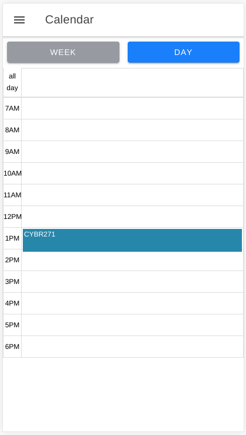
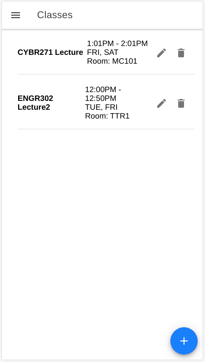

### SWEN325 Assignment 1 Report
###### Philip Oliver 300398228

#### Application Architecture

Mobile application architecture is split into 4 layers. These layers are: Presentation, 
Business, Data Access, and Service. In an ideal architecture, these 4 layers will be separate 
from each other.

  
*Image from 'Mobile Architecture Guide': Microsoft*

##### Presentation Layer

The presentation layer in a mobile application is made up of UI components
and other processes involved in creating the UI of the application.

The presentation layer in a react native application is typically represented in the 
render methods of the components. These render methods return react native tags
which are converted into native Android or iOS components for the UI.

The tags can be seen in the above image. These are the tags which are converted
to the native components for the app.

##### Business Layer

The business layer in a mobile application is made up of workflows. These
workflows allow the flow of data and providing data to the presentation layer.

In a react native application, the business layer is typically represented
as the methods in classes and components supporting the logic of the data flow.
This can be seen in the below screenshot: 

These methods provide interaction between the presentation and data access layer,
thus separating the other two layers and providing a workflow for the data.

##### Data Access Layer

The data access layer in a mobile application controls fetching and updating data 
stored in the application, or access to external storage components.

My implementation of the data access layer in my react native app was through the use
of utilities. These utilities were stored separately from the pages in a separate
folder and provided an interface between the business layer and the services the 
utilities talked to (such as firebase).
The services created were an authentication service, and a database service; 
these provided functionality through the use of functions which
were used by multiple pages. This abstraction also allowed for use of a 
singleton pattern, where there was at most one instance of each utility class.

The above image shows some of the main functions in the firestore utility.
As can be seen, this utility accesses firebase to put and fetch data from the
services.

##### Services

The service agents in the data access layer communicate with firebase 
in order to provide authentication and user storage. Between these two 
layers is a local cache. This cache stores data received from firebase 
and edits the local copies when a user edits the items before sending the 
changes or fetching from the externally stored firebase. This allows for quicker
response times when fetching data, and semi-persistent storage, in case the
phone's connection is unreliable. 

##### Organisation

The organisation of my folders can be seen above. Pages relating to different 
functionalities in the app are stored in different folders. This can be seen with 
the authentication, courses, and tasks folders. Utilities are stored in the util 
folder. These allow access to firestore and firebase, and also provide
tools required for switching pages (which will be discussed later).

#### Major External Component

The major external component I used for my application was Firebase. 
I made use of both the authentication and database services of Firebase.

In order to integrate Firebase to the application, it had to be added to
the build.gradle file for the app. The app then had to connect to Firebase
using the app name to be identified by Firebase. The access to Firebase
was stored in util files. This was the best way to add Firebase because 
it meets the separation of mobile architecture layers.

##### Authentication

The above image shows some registered users in the Firebase authentication service.
These are all users that have registered through the application. Registration and 
authentication was facilitated through my FirebaseUtils.js file, in which 
communication with Firebase happened through the react-native-firebase library.   
In addition to this, when a user was created, an entry for that user was created in the 
database. This was done so that the user would be able to add courses and classes for 
their use of the application.

##### Database

The database in Firebase which I used was constructed in a hierarchical structure.
This structure has users as the top level and with courses and tasks (respectively) 
extending down from the previous layer as can be seen in the images below. 
This allowed for a pseudo-foreign key relation between users, courses, and tasks where
courses belong to users, and tasks belong to courses.  

When a user adds a course or task, it is added to the database under their user
entry. This was facilitated by use of my FirestoreService.js file. This allowed
entering and retrieving data from the database, which also providing a caching service
in order to increase the response times from the external database. 

#### Reflection on React Native Framework

After the previous assignment with the app in Ionic, I thought that I would enjoy this
assignment more as I have used React previously. However, I was so wrong.

##### Versions
A problem I came across frequently was that the versions were changing far too frequently
for the documentation for most react native items to be kept up to date. This lead to 
far too many issues when trying to implement features into my app. For example, when I 
was adding a Drawer Navigator to my app, it took far too long to implement. This was 
because I was following react native documentation which was not up to date with the 
latest way of implementing the navigator.  
Another example, was when I tried to add a user created slider picker. I found a user
created picker which was perfect for what I wanted it for. However, it did not work 
when it was added in as the latest version of react, which had been included in the
version of react native I was using did not support some of the functions used in the 
picker. This was frustrating, as many problems came of react being updated so frequently.

##### Setup
The main problem I had with react native was due to the setup of the application.
I ran into many issues adding navigation (as discussed above), but also in integrating
firebase into the application. This stemmed from the issues due to outdated documentation,
but eventually I overcame this by using a react native firebase starter project. This 
project already had most of the firebase setup done. I then only had to connect the app
to my firebase project. 

##### Separation of Architecture
As a framework compared to ionic, react native does not have inbuilt separation of the 
layers of mobile architecture. In ionic with angular, the layers are separated through
use of services and different files for the layers. However, in react native this 
separation isn't supplied to the user explicitly. This means that it would be easier
to mix together different layers, thus not following the mobile architecture guide. 

##### Possible Improvements
Some possible improvements that could be made to react native are:
* 

#### UX Decisions

##### Log In Button

One of the first UX decisions I made while creating this application was in the use of the 
log in button. The decision I made was to have the Log In button disabled if the user had not
entered a valid email and password as can be seen below.

An alternative option which I was considering was to always have the Log In button enabled,
and if the user entered an invalid email or password then there would be an error message 
displayed underneath the text field as can be seen below.

I decided to opt for the first option for a number of reasons:
* The first option looks much cleaner. It is clear that the email and password must be 
valid to click the Log In button. In addition to this, the disabled/enabled button fits
a standard Android user's experience in mobile applications.
* The second option doesn't have space for the error messages to show up, so if a user
enters an invalid email and the error message shows up everything on the page below the 
error message will have moved down. If a user has to reenter information in the form
but the form has moved, this could easily throw them off. Muscle memory is a large part
of the design.

##### Create New Button

Another UX decision I made was to use a floating button in the bottom right of the screen
for adding new courses and classes. 

An alternative option I explored was to have some text underneath the courses or classes
which included a link to the add new course/class page. This is not dissimilar from how the 
page looks when there are no courses or classes which can be seen below. However, the text
would simply read "Add a Course" and would be positioned in an \<ion-item\> tag right underneath
the courses or classes.

The reasons I chose the first option were:
* The floating nature of the button means that if the whole page were to be filled with 
courses/classes, the button would always remain in the same position and would display
over the courses/classes. This allows the user to easily add a course/class without having 
to find where the button has moved to.
* The fixed position of the button in the lower right corner is in an optimal position for the
standard user. It is easily accessible by a small thumb movement and requires little effort
to reach. If the other option were chosen and there were no, or a small number of courses/classes
the user would have to reach to the top of the screen to add a new course/class.
* The lower right placement of a floating button is seen frequently in Android applications.
This means that a user would instinctively know what the button would do, as they will have seen
this in other applications, as it is a somewhat unified design.

##### Exit Menu Button

Another UX decision I made was to include a 'back' arrow in the side-menu to allow a user to 
easily close the menu. This can be seen in the top left of the image below.

An alternative option was to simply not have the button at all. This option can be seen in 
the image below. The menu simply has the title 'Menu', with no back arrow.

The reasons I chose to have the button were:
* It provides one-spot access to the menu. A user can both open and close the menu with the 
same gesture. They simply have to press at the top left of their screen. This allows familiarity
to the user, while also allowing quick access and close the menu if the user changes their mind
on if they want to use the menu.
* It allows the user multiple options to exit the menu. Not only can they swipe the menu away, or
tap outside the menu to close it, but they can also close it with a button. This allows the user
to choose which way they want to close the menu. Different users have their preferences for how 
to open or close something as trivial as a side-menu, so allowing the user to choose their preference
provides a more user-friendly experience.

#### Appendix

##### Login Page

The login page has 3 main components: email and password fields, and a log in button.
The log in button is only activate when valid email and passwords have been entered.
Once the log in button has been clicked, if the user is successfully logged in they are redirected
to the home page. If the user clicks on 'Create an account' they are redirected to the register page.

##### Register Page

The register page has 4 main components: email, password, and re-enter password fields, and 
a register button. The register button is only active when a valid email and password have been
entered, and also only when the 2 passwords match. When the register button is clicked, a pop-up
shows to alert the user if their registration was successful or not. If it was successful there is 
a button in the pop-up to let the user navigate to the log in page. 
If the user clicks on "Try to Log In" they are redirected to the log in page.

##### Home Page

The home page has one main role; it shows the classes that are on today. All the relevant 
information (course, room, and time) in a block. The home page is all the important information
provided by the application for the current time in one place.

##### Calendar Page

The calendar page shows all the classes for the current day or week. There are 2 buttons
to allow a user to switch between the weekly and daily views of the calendar.

##### Course Page

The courses page lists all the courses that a user has created. Each course has the course 
code and a description of the course. In addition to this, each course has an edit and delete 
button to provide the user with quick actions for the courses. This page also has a floating
button at the bottom right to allow a user to add new courses.

##### New Course Modal

The new course modal has 3 main components. Text fields for course code and course details. It 
also has a button to add the course. The button is only active when a course code has been entered
as this is the primary key for the course in the database. This page also has a back arrow in the
top left to allow a user to cancel adding a new course if they wish.

##### Classes Page

The classes page lists all the classes that a user has created. Each class has the course 
code and a description of the class, as well as the times, days, and rooms that the classes are in. 
In addition to this, each class has an edit and delete 
button to provide the user with quick actions for the classes. This page also has a floating
button at the bottom right to allow a user to add new classes.

##### New Class Page

The new class page has input fields for:
* Course: these options are populated from the courses that the user has entered
* Description: this is a simple text field
* Start/End Time: these are time picker fields
* Days: this is a multi-option selection of all the days in the week
* Room: this is a simple text field

This page also has a button to add the course. In addition to this, the page has a back
arrow in the top left to allow a user to cancel adding a new class if they wish.

